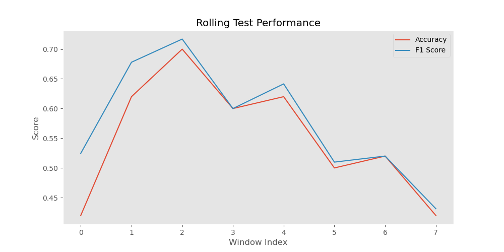
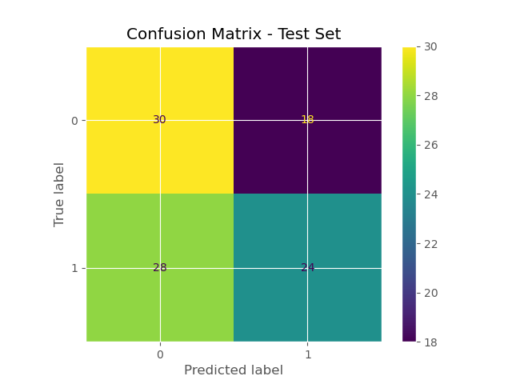

# BTC_CLASSIFIER_PROJECT

This project applies a binary classification approach to predict the next-day movement of Bitcoin closing price using technical indicators and time series cross-validation.

[](https://colab.research.google.com/github/Poggerv2/repositorio/blob/main/notebooks/03_modeling.ipynb)

## Structure

- `data/`: Raw and processed CSV files.
- `notebooks/`: Full modeling process, from EDA to evaluation.
    - `99_experiments`: Purging and stacking, but didn't yield significantly different results.
- `scripts/`: Modular Python code for data extraction, processing and modeling.
- `models/`: Exported final model and artifacts.
- `reports/`: Results, plots, and metrics.

## Model Summary

The final model is a `MLPClassifier` pipeline with `QuantileTransformer` and post-training probability calibration (sigmoid with 3-fold CV), validated with Rolling Test and `PurgedGroupTimeSeriesSplit` (See `99_experiments/Purging.ipynb`).  

Hold-out test results:
- **Accuracy**: 0.58  
- **F1-score**: 0.73  
- **ROC AUC**: 0.48  
- **Brier Score**: 0.24  

The high F1-score reflects good performance in identifying positive classes (price up), even though AUC is limited, which is expected given market noise.

  


## Features Used:
- `close_pct_change`
- `close_pct_change_lag1`
- `cum_return_7_lag1`
- `low_close`
- `high_low`
- `sma_ratio_10_20_lag1`
- `log_return_5`
- `candle_body_ratio`
- `momentum_lag1`

## Stacking Experiment

A `StackingClassifier` was tested combining:
- `Gradient Boosting Classifier`
- `MLPClassifier`

**Preprocessing**:  
`PowerTransformer (Yeo-Johnson)` + `QuantileTransformer (normal output distribution)` for both base models.

**Individual models (Rolling Test, threshold 0.5)**:
- **Gradient Boosting** → **Accuracy**: 0.5825, **F1-score**: 0.6001, **ROC AUC**: 0.5929  
- **MLP** → **Accuracy**: 0.5475, **F1-score**: 0.6128, **ROC AUC**: 0.6006  

**Stacking (final estimator: LogisticRegression)**:
- **Accuracy**: 0.5025  
- **F1-score**: 0.6443  
- **ROC AUC**: 0.4866  

The stacking approach did not outperform the best individual model but remains documented as part of the experimentation process.

## PurgedGroupTimeSeriesSplit Validation

To ensure the absence of data leakage, `PurgedGroupTimeSeriesSplit` was applied:
- **n_splits**: 5  
- **group_gap**: 5  
- **Grouping variable**: date index  

**Average metrics**:
- **Accuracy**: 0.496  
- **F1-score**: 0.618  
- **ROC AUC**: 0.478  
- **Brier Score**: 0.256  

Results were consistent with the rolling test, confirming that the main validation process was leakage-free.

## Installation

- Python 3.10 or higher

### If you just want to **run the final model and reproduce results**:
```bash
pip install -r basic_requirements.txt
python run.py
```

### If you want to explore the notebooks, do experiments, retrain or modify the pipeline:
```bash
pip install -r requirements.txt
```


## Key Findings

Although the dataset is relatively small (~500 samples), the use of domain-specific features and rigorous time series validation allowed the model to learn basic directional patterns. Techniques like purging, threshold tuning, and robust pipelines improved generalization. While the prediction power is limited (as expected in financial markets), the process is transparent, reproducible, and leakage-free.
